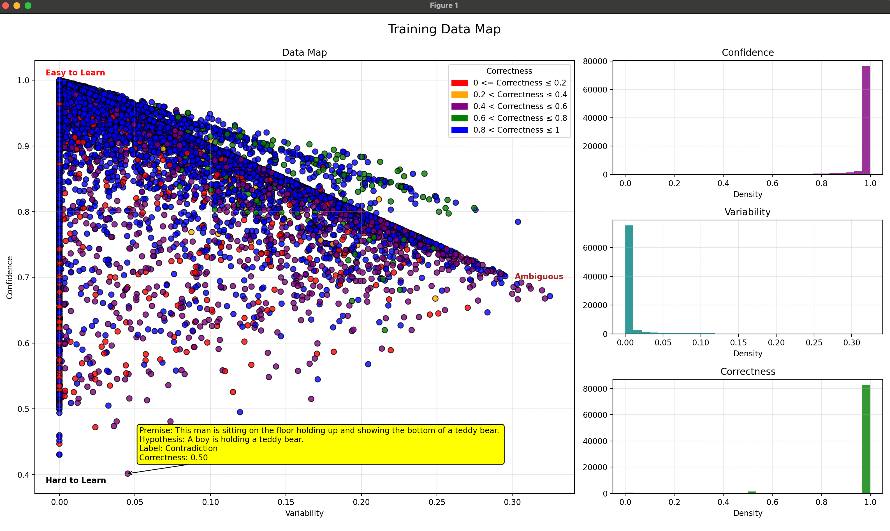

# Focused-Training-Cartography

This repository, **Focused-Training-Cartography**, contains code to create cartographic plots for training data with tooltips, which show the original dataset record. The primary objective is to identify and address hard-to-learn and ambiguous examples using cartographic data analysis techniques.

## Features

- **Cartographic Plots with Tooltips**: Generates cartographic maps to visualize training data points with tooltips that display the original dataset record (hypothesis, premise, and labels) for each instance.
- **Custom Trainer with Callback**: Implements a custom training loop with callbacks to capture confidence, variability, and correctness scores for each training instance.
- **Focused Training**: Runs focused training using min/max values for confidence, variability, and correctness, allowing targeted improvements.
- **Focused Dataset Creation**: Automatically creates focused datasets for fine-tuning based on criteria such as low confidence and high variability.
- **Ensemble Learning**: Combines models trained on different data subsets to improve generalization and robustness.

## Files Included

- **CustomTrainer.py**: A custom trainer to use while training, enabling capturing of detailed metrics.
- **CartographyCallback.py**: A custom callback that saves the metrics along with the hashcode of the concatenated string of hypothesis and premise, separated by a separator.
- **generate\_data\_map.py**: Generates the cartographic plots and includes the tooltip code, allowing you to hover over any point to see the source record.

## Installation

To use the code in this repository, you need to have Python 3.7+ and the following dependencies:

```bash
pip install -r requirements.txt
```

The key dependencies include:

- `transformers`: HuggingFace library for training Electra-Small
- `matplotlib`: For visualizing cartographic maps
- `mplcursors`: For displaying the tooltips for source record 

## Usage

### Training the Model

To train using the CustomTrainer model use the following code:

```bash
trainer = CustomTrainer(
        model=model,
        args=training_args,
        train_dataset=train_dataset_featurized,
        eval_dataset=eval_dataset_featurized,
        tokenizer=tokenizer,
        data_collator=data_collator,
        
        compute_metrics=compute_metrics_and_store_predictions,
        callbacks=[CartographyCallback()]  # Add the cartography callback here
    )
```

### Capturing Confidence and Variability Scores

The custom trainer automatically logs confidence, variability, and correctness scores for each instance. These scores are used to create focused datasets and cartographic visualizations.


### Generating Cartographic Maps

To generate cartographic maps to visualize the training data points:

```bash
python generate_data_map.py --checkpoint_dir .
```

This generates a plot that allows inspection of data points, including tooltips that display the hypothesis, premise, and labels for each instance. The checkpoint\_dir is the parent directory of all your huggingface checkpoints as the jsons with the metrics are stored here



### Fine-Tuning on Focused Dataset

To fine-tune the model on a focused subset of data using min/max confidence, variability, and correctness, create a dataset from the checkpoints directory using code like this :

```bash
train_dataset = Dataset.from_dict(get_focussed_sets(checkpoint_dir=args.checkpoint_dir,max_confidence=args.max_confidence, min_confidence=args.min_confidence, max_variability=args.max_variability, min_variability=args.min_variability, max_correctness=args.max_correctness, min_correctness=args.min_correctness))          
```

Pass in the filter criteria like min\_*confidence, max\_confidence,  min\_*variability etc. You can now train your trainer on this custom dataset to do targeted training.

## Ensemble Learning

Just using a model trained on subset of data. Usually does not improve performance. A better approach is to use the generic model and the targetted model and use the mean of the 2 logits to do the predictions. This custom trainer class TwoModelMeanTrainer.py has been added for that purpose. You can invoke it so.

&#x20;        &#x20;

```bash
trainer = TwoModelMeanTrainer(
        model=model,
        model1=model,
        model2=model2,
        w1=args.w1,
        args=training_args,
        train_dataset=train_dataset_featurized,
        eval_dataset=eval_dataset_featurized,
        tokenizer=tokenizer,
        data_collator=data_collator,
        
        compute_metrics=compute_metrics_and_store_predictions,
       )
```

## Results

The key findings from the training experiments using Electra-small on snli dataset include:

- Baseline accuracy: **89%** on SNLI dataset.
- Improved accuracy on challenging examples with focused dataset fine-tuning.
- Robust performance using an ensemble of multiple models which gave a little over 89%, but probably can be improved further with more training data.

## Cartographic Analysis Example

The cartographic map shows how the model interacts with different subsets of data, allowing targeted improvements.


## Citation

If you find this repository useful, please cite:

```
@article{bhattacharya2024nli,
  title={Improving Natural Language Inference with Cartographic Data Analysis},
  author={Rahul Bhattacharya},
  year={2024}
}

@inproceedings{swayamdipta2020dataset,
    title={Dataset Cartography: Mapping and Diagnosing Datasets with Training Dynamics},
    author={Swabha Swayamdipta and Roy Schwartz and Nicholas Lourie and Yizhong Wang and Hannaneh Hajishirzi and Noah A. Smith and Yejin Choi},
    booktitle={Proceedings of EMNLP},
    url={https://arxiv.org/abs/2009.10795},
    year={2020}
}
```

## License

This project is licensed under the MIT License. See the [LICENSE](LICENSE) file for more details.

## Contact

For questions or collaborations, please contact:

- Rahul Bhattacharya ([rahulbats@gmail.com](mailto\:rahulbats@gmail.com))

